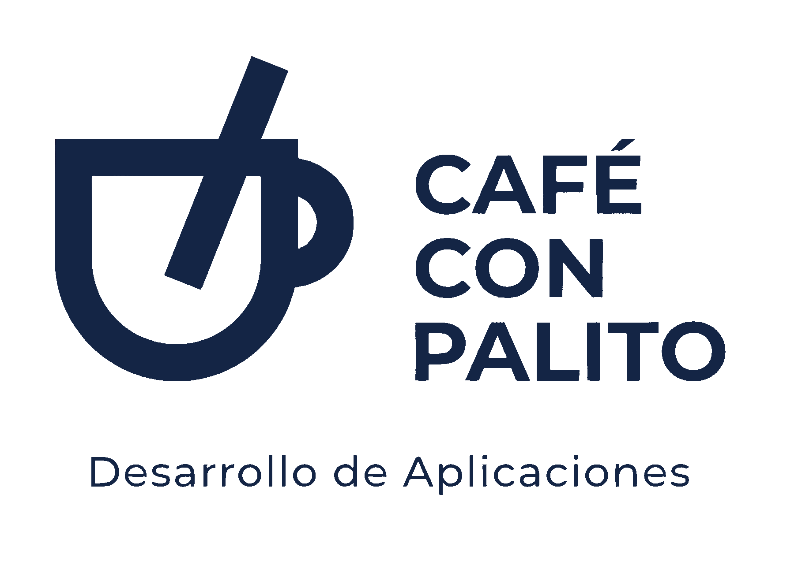

 

# Proyecto Chikara

Este proyecto tiene como objetivo brindar inspiración y motivación a través de contenido positivo y alentador. Nuestro objetivo es ayudar a las personas a superar los desafíos diarios y alcanzar sus metas.

### Características principales

- Crear motivaciones personales privadas o publicas
- Dar a conocer tus motivaciones para que otras personas las usen
- Recibir el apoyo para completar esas motivaciones que tienes

### Tecnologías utilizadas

- Python con FastAPI para el desarrollo del backend
- Kotlin para el desarrollo de la app de movil
- Base de datos relacional para almacenar la información de los usuarios.
- Base de datos no-relacional para almacenar la informacion de las motivaciones.

### Contribución

¡Nos encantaría que te unas a nuestro proyecto! Si tienes ideas, sugerencias o contenido para compartir, no dudes en contribuir. Puedes hacerlo a través de nuestro repositorio en GitHub: [TFCProyectoChikara](https://github.com/CafeConPalito/TFCProyectoChikara).

### Repositorios del proyecto.

* Main - [TFCProyectoChikara](https://github.com/CafeConPalito/TFCProyectoChikara) - Solo Documentación
* API - [TFCProyectoChikaraAPI](https://github.com/CafeConPalito/TFCProyectoChikaraAPI)
* APP Movil - [TFCProyectoChikaraAndroid](https://github.com/CafeConPalito/TFCProyectoChikaraAndroid)
* Pruebas Kotlin - [TFCPruebas](https://github.com/CafeConPalito/TFCPruebas)

## Integrantes
* Albano Díez de Paulino - [GITHUB](https://github.com/TerciodeMarte) - [LINKEDIN](https://www.linkedin.com/in/albano-diez/)
* Daniel Espinosa García - [GITHUB](https://github.com/Daniel-Espinosa) -  [LINKEDIN](https://www.linkedin.com/in/daniel-espinosa-garc%C3%ADa/)
* Ramiro Gutiérrez Valverde - [GITHUB](https://github.com/ramirogvalverde) - [LINKEDIN](https://www.linkedin.com/in/ramirogvalverde/)

## Licencia 📄

Este proyecto está bajo la Licencia (GPL-3.0) - mira el archivo [LICENSE.md](LICENSE.md) para detalles

## Expresiones de Gratitud 🎁

* Comenta a otros sobre este proyecto 📢
* Invita una cerveza 🍺 o un café ☕ a mi profesor. 
* Da las gracias públicamente 🤓.

---
⌨️ con ❤️ por [CafeConPalito](https://github.com/CafeConPalito) 😊
